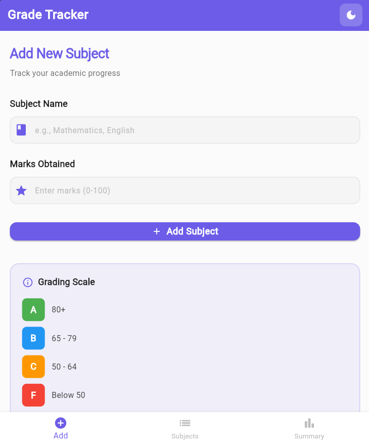
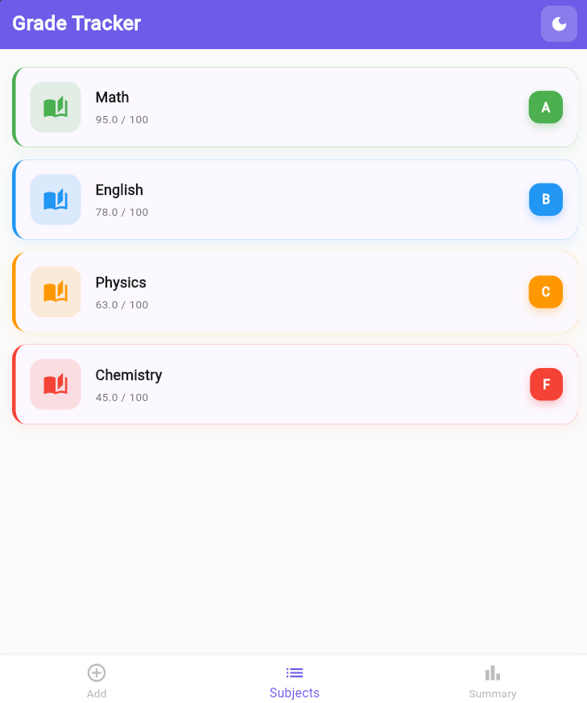
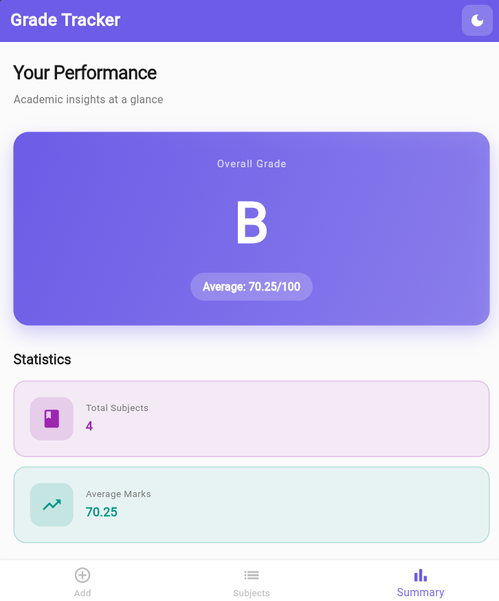

# 📚 Student Grade Tracker App
A Flutter application for managing student grades and tracking academic performance. The app allows users to add subjects with marks, automatically calculates grades, and provides a live summary of academic results. This project was developed as part of a Flutter programming assignment.


# ✨ Features
- Add new subjects with marks
- Form validation for subject name and marks (0–100)
- View all subjects in a scrollable list
- Automatically calculate grades (A, B, C, F)
- Swipe to delete subjects using Dismissible
- Live result summary with:
  - Total number of subjects
  - Average mark
  - Overall grade
- Light/Dark theme toggle
- Custom ThemeData with no hardcoded colors
- State management using Provider (no `setState`)


# 📱 Screens

1. Add Subject
- Enter subject name
- Enter marks (0–100)
- Input validation before submission

2. Subject List
- Displays all added subjects
- Shows:
  - Subject Name
  - Marks
  - Grade
- Swipe left or right to delete a subject

3. Summary
- Total number of subjects
- Average marks
- Overall grade
- Updates automatically whenever subjects are added or removed


# 🏗️ Project Structure

lib/
├── screens/
│   ├── add_subject_screen.dart
│   ├── subject_list_screen.dart
│   └── summary_screen.dart
├── subject.dart
├── subject_provider.dart
└── main.dart


# 🛠️ Technologies Used
- Flutter
- Dart
- Provider
- Material Design


# 🚀 Getting Started

### Prerequisites
- Flutter SDK
- Dart SDK
- Android Studio or VS Code

### Installation

1. Clone the repository

```bash
git clone https://github.com/zohora11/Student-Grade-Tracker-App.git
```

2. Navigate to the project

```bash
cd Student-Grade-Tracker-App
```

3. Install dependencies

```bash
flutter pub get
```

4. Run the application

```bash
flutter run
```


# 📷 Screenshots
| Add Subject | Subject List | Summary |
|-------------|--------------|----------|
|  |  |  |


# 📖 Grade Calculation

| Marks | Grade |
|------:|:------|
| 80 – 100 | A |
| 65 – 79 | B |
| 50 – 64 | C |
| Below 50 | F |


# 👨‍💻 Author
Fatema Tuz Zohora
Department of Computer Science and Engineering 

